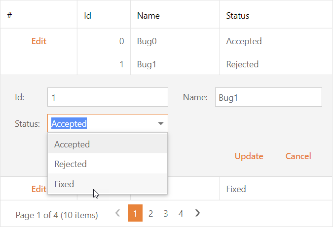

<!-- default badges list -->

<!-- default badges end -->
# Grid View for ASP.NET Web Forms - How to bind a ComboBox column programmatically in code behind
<!-- run online -->
**[[Run Online]](https://codecentral.devexpress.com/128537725/)**
<!-- run online end -->
This example demonstrates how to use a list of business objects as a data source for a Grid View's ComboBox column.

## Files to Look At

- [Bug.cs](./CS/Solution/Bug.cs) (VB: [Bug.vb](./VB/Solution/Bug.vb))
- [BugStatus.cs](./CS/Solution/BugStatus.cs) (VB: [BugStatus.vb](./VB/Solution/BugStatus.vb))
- [Default.aspx](./CS/Solution/Default.aspx) (VB: [Default.aspx](./VB/Solution/Default.aspx))
- [Default.aspx.cs](./CS/Solution/Default.aspx.cs) (VB: [Default.aspx.vb](./VB/Solution/Default.aspx.vb))

## Documentation

- [Grid View - Bind to Data](https://docs.devexpress.com/AspNet/3719/components/grid-view/concepts/bind-to-data)
- [Combo Box - Bind to Data](https://docs.devexpress.com/AspNet/DevExpress.Web.ASPxComboBox#bind-to-data)

## More Examples

- [Grid View for ASP.NET Web Forms - How to dynamically switch the Grid's data source and recreate columns at runtime](https://www.devexpress.com/Support/Center/p/E448)
- [Grid View for ASP.NET Web Forms - How to bind a Combo Box column to data based on the row index in batch edit mode](https://supportcenter.devexpress.com/ticket/details/t190978/grid-view-for-asp-net-web-forms-how-to-bind-a-combo-box-column-to-data-based-on-the-row)
